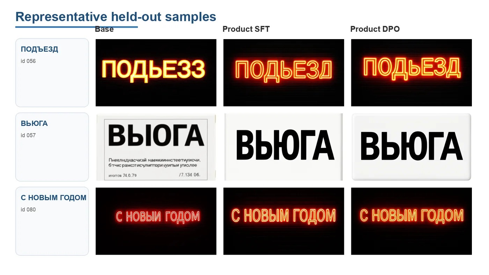
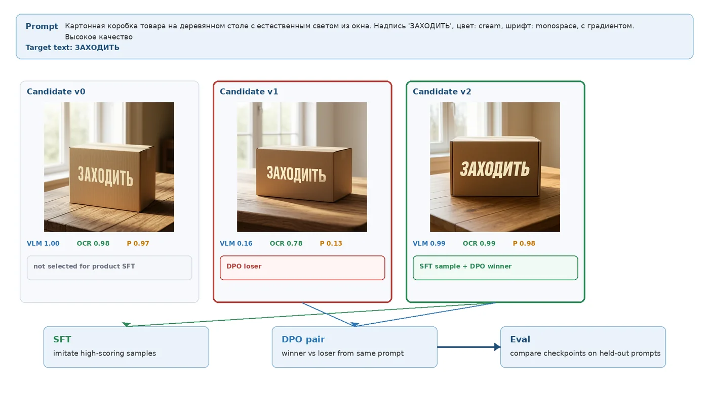

# Diffusion Text Tuner

[](https://github.com/outrun32/diffusion-text-tuner/actions/workflows/quality.yml)
[](LICENSE)

Reward-filtered LoRA alignment of FLUX.2 Klein Base 4B for Russian and Cyrillic text rendering.

[Project page](https://outrun32.github.io/diffusion-text-tuner/project-page/) ·
[Prompt dataset](https://huggingface.co/datasets/Outrun32/cyrillic-prompts-15k) ·
[Evidence bundle](reports/final/README.md)



*Static examples from the thesis defense. Base is the unadapted model; Product SFT and Product DPO
are LoRA checkpoints. The source rows and checkpoints are unavailable, so these images are
qualitative historical evidence rather than a reproducible benchmark.*

## Why this project exists

The work began with a client request: make an open-source image model place supplied names and short
phrases inside generated images. English was the first target. Russian exposed the harder problem:
models dropped letters, substituted Cyrillic glyphs, or mixed them with Latin homoglyphs even when
the surrounding image looked correct.

Ordinary image-reconstruction training was a poor match for that failure. Clean Russian text-image
data was scarce, and the error of interest was discrete: did the model write the requested text?
This project treats the task as alignment instead. It generates several candidates, scores the text
inside each image, then trains on the candidates that pass the reward.

## Historical result

On the recorded defense benchmark, Product SFT reduced normalized character error rate from `0.859`
to `0.126`. Product DPO reached the highest normalized exact-match rate, but its normalized CER was
worse than Product SFT.

| Checkpoint | Normalized CER ↓ | Normalized exact match ↑ |
| --- | ---: | ---: |
| Base | 0.859 | 41.7% |
| Product SFT | **0.126** | 50.0% |
| Product DPO | 0.168 | **52.5%** |

> **Evidence status:** these numbers are transcribed defense aggregates. The original per-sample
> scores, run manifests, and checkpoint hashes are not in the repository, so the table cannot be
> recomputed from this checkout. The complete aggregate table and its status live in
> [reports/final](reports/final/README.md).

The claim stays narrow: Product SFT had the lowest CER among the three recorded rows. It does not
show that product filtering wins on every prompt distribution or language.

## Method

1. Generate several images for each prompt with the base model.
2. Score whether the requested text appears using a VLM and OCR.
3. Keep high-scoring candidates for LoRA self-training; turn the best and worst candidates into
   preference pairs.
4. Compare Base, Product SFT, and Product DPO on prompts excluded from training.



*The candidate panel is a static method illustration from the defense materials, not an auditable
evaluation row.*

The thesis Product reward has one definition:

```text
thesis_vlm_ocr_product_v1 = score_vlm × score_ocr
```

The SFT path fits a LoRA adapter to selected generated samples with flow-matching MSE. The DPO path
uses policy-versus-reference flow-matching errors for winner/loser pairs; it is a diffusion
surrogate, not language-model DPO.

A separate five-component geometric score exists for diagnostics. It combines VLM, OCR, CER,
entropy, and exact match, and must not be compared with the thesis Product column as though they were
the same metric.

## Quick start

With Python 3.11, [uv](https://docs.astral.sh/uv/), and ShellCheck installed:

```bash
uv python install 3.11
uv sync --frozen --group dev --extra lint
make check
```

This runs lint, formatting checks, the CPU-safe test suite, and evidence verification. Model loading,
OCR probes, integration jobs, and GPU work stay outside the default test run.

FLUX image generation, PyTorch VLM scoring, latent baking, SFT, DPO, masked-SFT, and ReFL require a
Linux/CUDA host. The runnable command sequence and artifact contracts are documented in
[docs/commands.md](docs/commands.md) and [docs/runtime_contracts.md](docs/runtime_contracts.md).

## Data and evidence

The public prompt dataset contains 15,000 rows. Its revision and file hashes are pinned in
[prompt_dataset_source.manifest.json](reports/final/prompt_dataset_source.manifest.json).

The replacement benchmark contains 120 unique targets across six difficulty slices, with no exact
target overlap against the pinned training pool. It is committed as
[benchmark_prompts_v2.jsonl](reports/final/benchmark_prompts_v2.jsonl), but it has no model scores
yet. A valid comparison needs the original checkpoints or a new multi-seed CUDA run.

What the checkout can verify:

- dataset hashes, target disjointness, and evidence manifests;
- reward and objective math, config validation, and selection contracts;
- CPU-safe tests, lint, security checks, and report generation;
- command paths that fail before model loading on unsupported hosts.

Generated images, score files, tensors, checkpoints, private manifests, and logs remain outside Git.
Small reviewed fixtures, the project-page figures, and `reports/final/` are the deliberate
exceptions.

## Where to look

- [`src/`](src/) contains reusable generation, scoring, training, runtime, and evaluation code.
- [`scripts/`](scripts/) contains command-line entry points and manual diagnostics.
- [`configs/`](configs/) contains experiment, prompt, accelerator, and evaluation configs.
- [`reports/final/`](reports/final/) separates checkout-verifiable artifacts from historical
  aggregates.
- [`docs/`](docs/) explains command ownership, evaluation, provenance, and extension rules.

Start with [the command index](docs/commands.md), [runtime contracts](docs/runtime_contracts.md),
[reward and evaluation validity](docs/reward_evaluation.md), or
[repository boundaries](docs/structure_and_extension.md).

## Limitations

- The recorded evidence covers Russian and Cyrillic text, not multilingual rendering in general.
- Raw historical score rows and Product SFT/DPO checkpoints are unavailable.
- Product filtering favored shorter, easier samples in the recorded aggregate; the missing rows
  prevent a causal analysis.
- OCR and Qwen participated in selection and evaluation, so they are not independent judges.
- The historical table uses one image per prompt and has no confidence intervals. DPO pairs were
  generated by Base while the policy started from SFT, which makes the preference set off-policy.

## Citation

This repository is the public codebase for an individual bachelor thesis completed at Innopolis
University.

```bibtex
@thesis{saparov2026cyrillic,
  title  = {Developing a Diffusion-based Training Toolkit for Multilingual Text Rendering},
  author = {Saparov, Iakov},
  school = {Innopolis University},
  year   = {2026}
}
```

## License

Code and documentation are available under the [Apache License 2.0](LICENSE). Model weights and
third-party datasets keep their upstream licenses and access terms.
